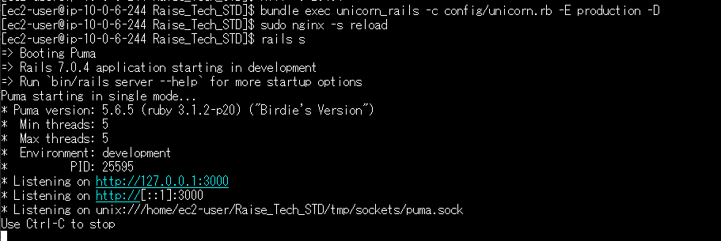
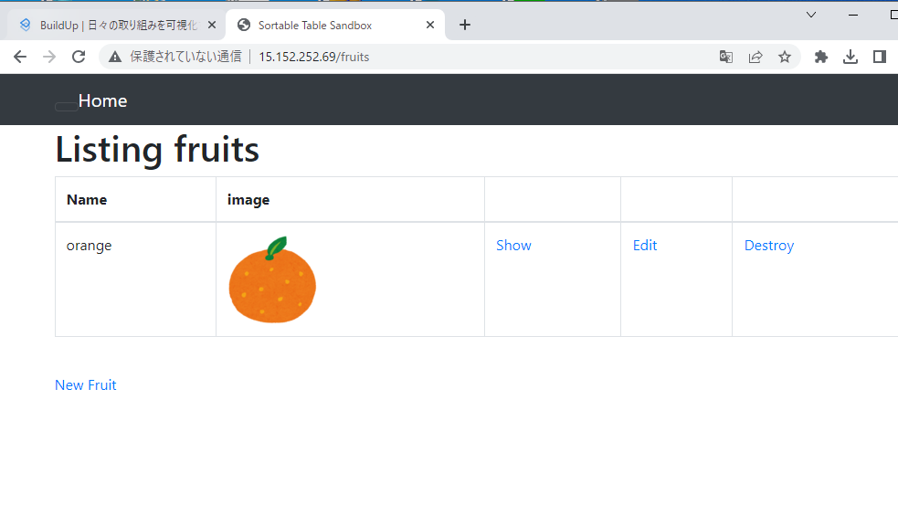

# Lecture05

1. EC2・RDS・VPC・S3・ALBの設定

必要なAWSリソースを設定。(EC2/RDS/VPC/S3/ALB)


Windows環境からTeratermにてSSH接続(ED25519を使用)


2. EC2環境にアプリ動作環境を構築
   *ローカルと同じ環境を構築するよう意識
```EC2インストール
#アップデート+諸々インストール
sudo yum update
sudo yum -y install git make gcc-c++ patch openssl-devel libyaml-devel libffi-devel libicu-devel libxml2 libxslt libxml2-devel libxslt-devel zlib-devel readline-devel


#Node.js Yarn
curl -o- https://raw.githubusercontent.com/nvm-sh/nvm/v0.34.0/install.sh | bash
. ~/.nvm/nvm.sh
nvm install v16.20.0

curl -sL https://dl.yarnpkg.com/rpm/yarn.repo | sudo tee /etc/yum.repos.d/yarn.repo
sudo yum -y install yarn

#rbenv
git clone https://github.com/sstephenson/rbenv.git ~/.rbenv
echo 'export PATH="$HOME/.rbenv/bin:$PATH"' >> ~/.bash_profile
echo 'eval "$(rbenv init -)"' >> ~/.bash_profile
source ~/.bash_profile

#ruby-build
git clone https://github.com/sstephenson/ruby-build.git ~/.rbenv/plugins/ruby-build
rbenv rehash

#Ruby 3.1.2
export -p TMPDIR="$HOME/"

rbenv install -v 3.1.2
rbenv global 3.1.2
rbenv rehash
ruby -v

#MySQL8.0
curl -fsSL https://raw.githubusercontent.com/MasatoshiMizumoto/raisetech_documents/main/aws/scripts/mysql_amazon_linux_2.sh | sh

#bundle2.3.14
gem install bundler -v 2.3.14

#nginxインストール
sudo amazon-linux-extras install -y  nginx1

sudo yum -y  installl ImageMagick

githubからアプリをクローン
git clone https://github.com/(Your_APP_Github_page)

cd　/アプリ名
bundle install
```
3. EC2環境に合わせて設定ファイルを変更
   シークレットキーを設定
   
3-1. config/database.ymlを修正
```database.yml
  adapter: mysql2
  encoding: utf8mb4
  pool: <%= ENV.fetch("RAILS_MAX_THREADS") { 5 } %>
  username: root
  password: "YOURPASSWORD"
  socket: /var/lib/mysql/mysql.sock
socketを上記のように変更。
*PASSWORDはMYSQL内で設定のこと

*以下は本番環境用
　production:
  <<: *default
  database: "YOUR_DataBase名"
  username: RDS_USERNAME
  password: RDS_PASSWORD
  host: RDS_END_POINT
  port: RDS_PORT
```

3-2.  /etc/nginx/conf.d/rails.confを編集
```rails.d/conf
　listen 80;
  server_name Elastic IP ADDRESS;
  root YOUR_APP_FILE_PATH/public;
```

MYSQL,NGINX,UNICORNが正常に設定できていると以下のように接続できる


HTTPでELASTIC_IPに接続するとアプリ画面が確認できるはずである。


できない場合はEC2のセキュリティからインバウンドルールを見直すべきである。

今回の構成は以下の通りと考えている。


