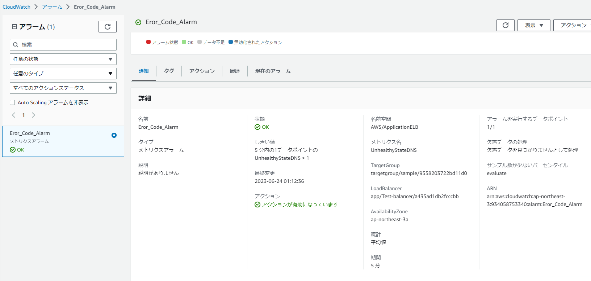
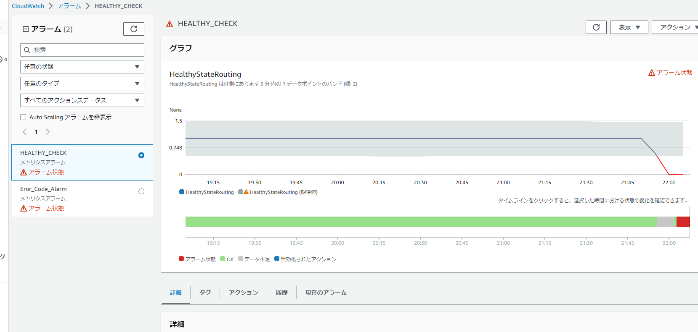
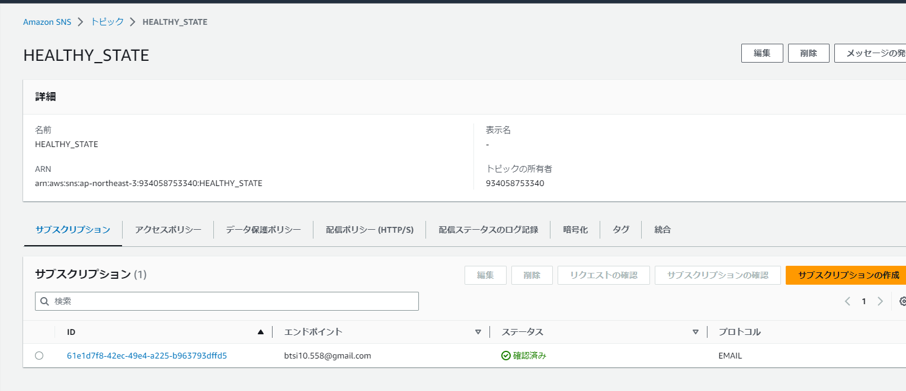
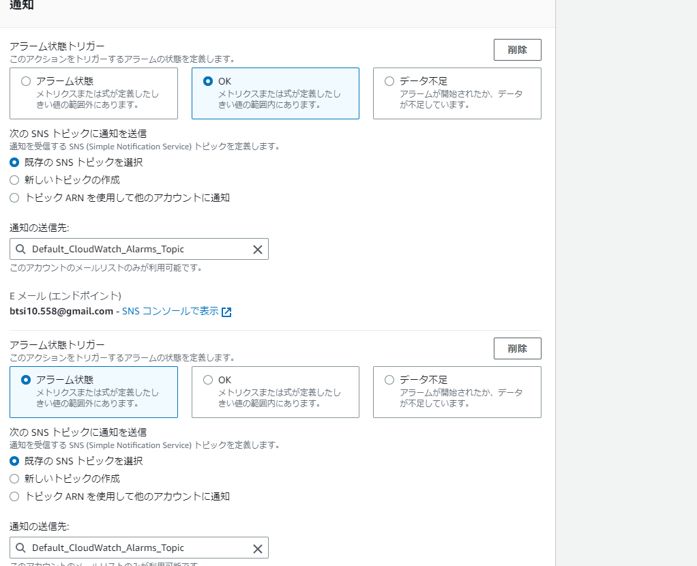
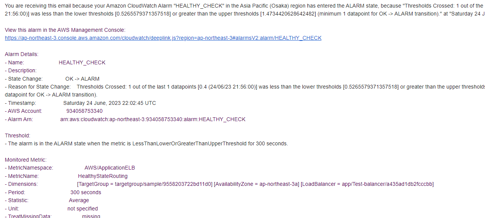
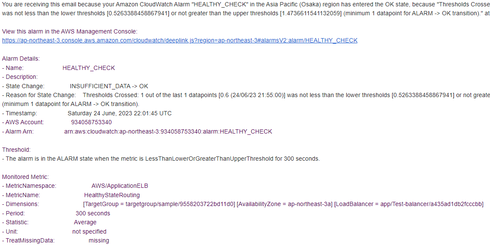
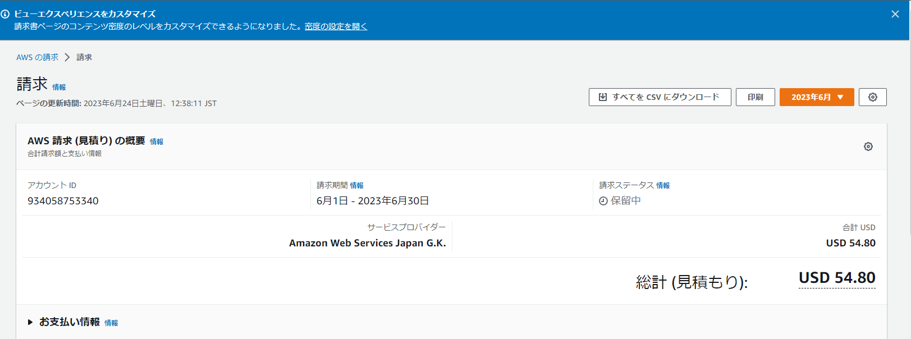

# Lecture06課題

1. CroudTrailのLOG
イベント名：PutDeliveryChannel
含まれている情報
　・AWSリージョン
　・IPアドレス
　・ユーザーエージェント
 
```CroudTrail.log
    "userIdentity": {
        "type": "IAMUser",
        "userName": "Raise_Tech_Lecture",
        "sessionContext": {
            "sessionIssuer": {},
            "webIdFederationData": {},
            "attributes": {
                "creationDate": "2023-06-21T12:28:04Z",
                "mfaAuthenticated": "true"
            }
        
    
    "eventTime": "2023-06-21T12:33:16Z",
    "eventSource": "config.amazonaws.com",
    "eventName": "PutDeliveryChannel",
    "awsRegion": "ap-northeast-3",
    "sourceIPAddress": "218.221.229.54",
    "userAgent": "AWS Internal",
    "errorCode": "InsufficientDeliveryPolicyException",
    "errorMessage": "Insufficient delivery policy to s3 bucket: fukuisampleappbucket, unable to write to bucket, provided s3 key prefix is 'null', provided kms key is 'null'.",
    "requestParameters": {
        "deliveryChannel": {
            "name": "default",
            "s3BucketName": "fukuisampleappbucket"}
```

2. Cloudwatch Alarm

   アラームとしてUNHEALTHYをカウントするアラームを設定した。
   AMAZON SNSを利用してメッセージ送付
   →　送信先はE-mailを設定。
 
   

   

　 

   
  


   OKの時は緑、MYSQLD,UNICORN,NGINXを切断した際は赤

　　実際に届いたのは以下のメール

  2-1. アラーム時メール
   
　

  2-2. OK時メール

  


3. 請求
   RDSを使いすぎた？10000￥近い請求
　　
   
