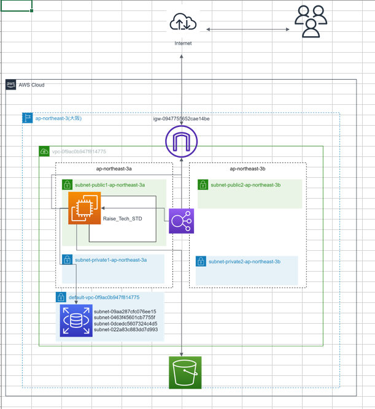
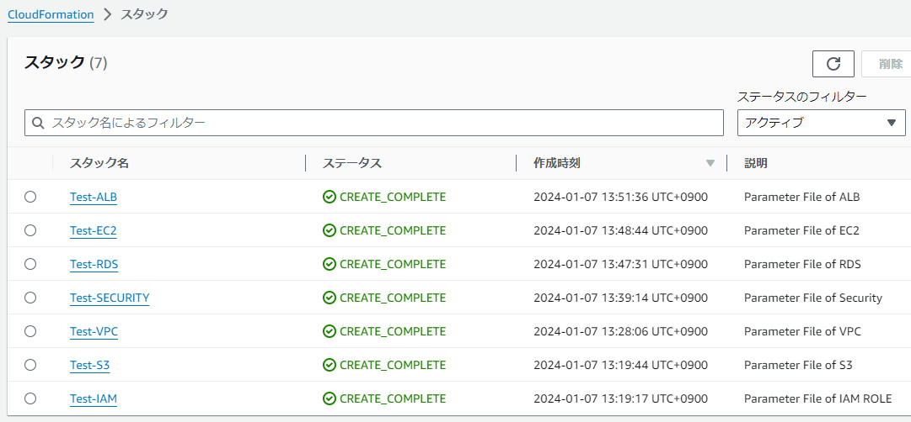
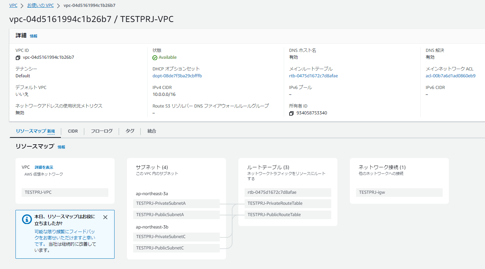
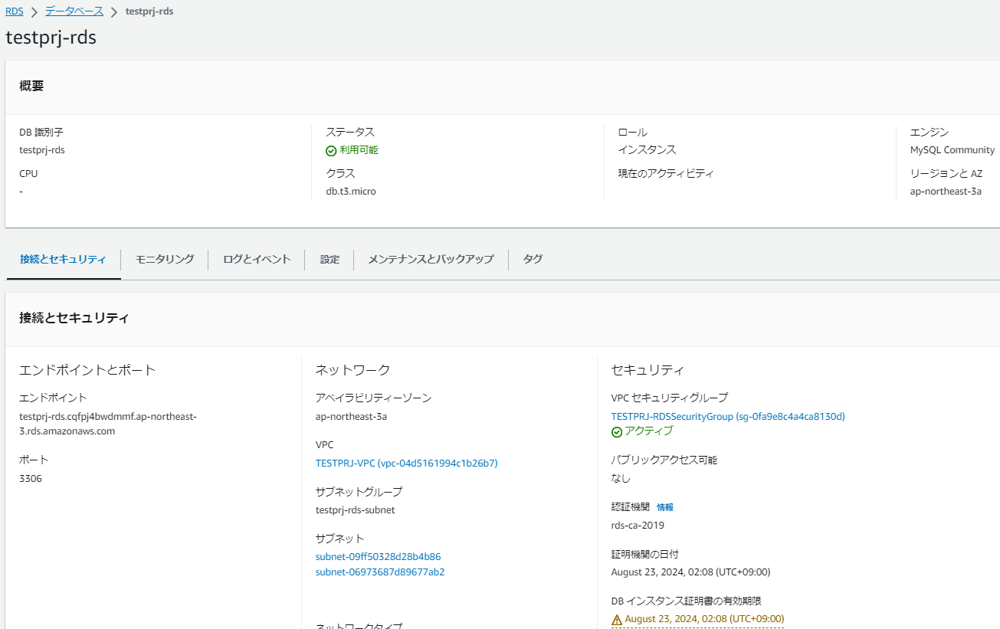
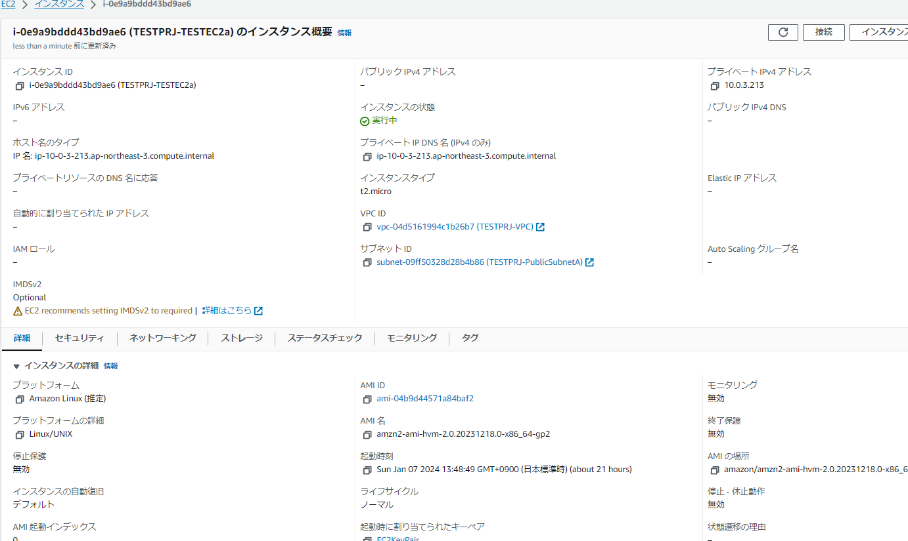
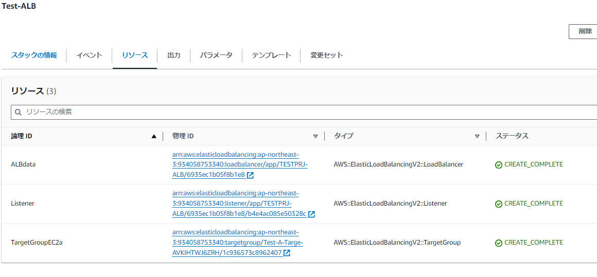

# Lecture10課題

Textから以下の通りの課題があり、挑戦。
＜＜CloudFormation を利用して、課題5で作った環境をコード化しましょう。
＜＜コード化ができたら実行してみて、環境が自動で作られることを確認してください。

1. 目的となる環境の確認

2. 必要な要素ごとにCloud Formationを作成する。

　2-1. VPC,RDS,S3,EC2,ALBが必要なので、それぞれ現環境に合わせて作成
 
   Lecture10/Template/VPC.yml
   
   Lecture10/Template/RDS.yml
   
   Lecture10/Template/S3.yml
   
   Lecture10/Template/EC2.yml

   Lecture10/Template/ALB.yml
   
  2-2. S3が作成できず、調べたところIAMロールがないとのことでIAMロールを与える部分も作成。
     
   Lecture10/Template/IAMROLE.yml
   
  2-3. 通信に関するセキュリティファイルがばらばらで探しづらかったので一つにまとめた。
  
   Lecture10/Template/SECURITY_FILE.yml

3. 作成した状態
   
   

   

   

   

   

   
