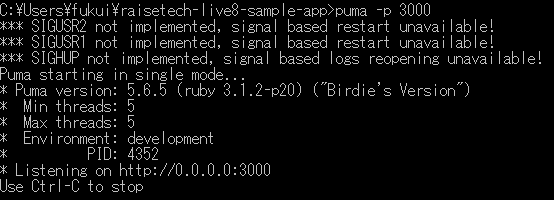
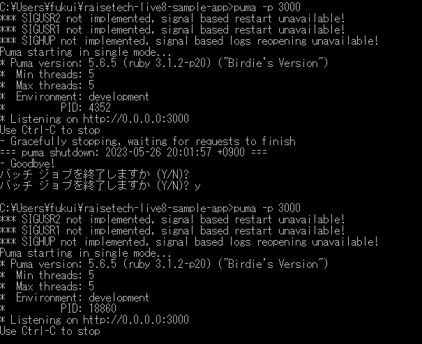
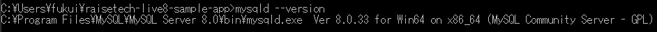
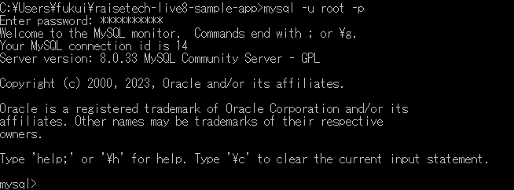
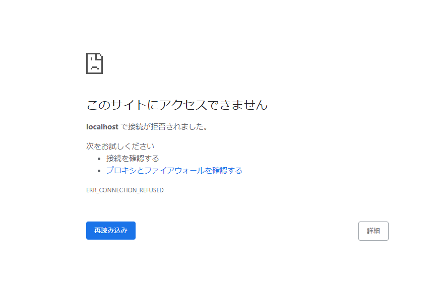

# AP サーバーについて調べてみましょう。
1. AP サーバーの名前とバージョンを確認してみましょう。

APサーバ名：puma Version 5.6.5

   
2. AP サーバーを終了させた場合、引き続きアクセスできますか？

接続できず

    
4. 結果を確認して、また AP サーバーを起動してください。

確認後再接続

# DB サーバーについて調べてみましょう。
1. サンプルアプリケーションで使った DB サーバー（DB エンジン）の名前と、今 Cloud9 で動作
しているバージョンはいくつか確認してみましょう。

DBサーバ名：MySQL Server Ver8.0.33

   
2. DB サーバーを終了させた場合、引き続きアクセスできますか？

接続できず

# Rails の構成管理ツールの名前は何でしたか？確認してみてください。
  　
   Bundlerで管理をする。パッケージはGem 　

# 今回の課題から学んだことを報告してください。

   ・ローカル環境の構築と、SQLサーバへの接続の方法を学んだ。
   ・アプリケーションの動かし方の基本を学んだ。
   
